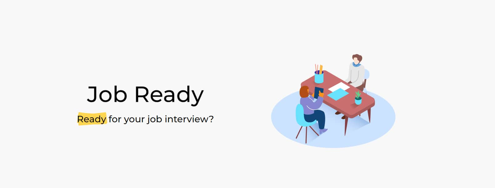

  

# JobReady

JobReady is a platform that helps you find your ideal job. By connecting you to the well-known job platform InfoJobs , you can discover a wide variety of job offers. In addition, JobReady offers you the possibility to simulate interviews to evaluate your preparation and ensure success in real interviews. Find your ideal job and get ready to stand out with JobReady.

### How does it work?

First, you will be asked a few questions to determine which job is the best fit for you. This will be followed by a mock interview with 7 questions. At the end, you will receive a score and suggestions for improvement. Discover the ideal job for you and hone your interviewing skills with JobReady, your partner on the road to career success.

### Technologies used

- [React](https://react.dev/)
- [TypeScript](https://www.typescriptlang.org/)
- [Tailwind](https://tailwindcss.com/)
- [React router DOM](https://reactrouter.com/)
- [Framer motion](https://www.framer.com/)
- [React rough notation](https://roughnotation.com/)

#### API's

- [InfoJobs API](https://developer.infojobs.net/)
- [OpenAI API](https://platform.openai.com/)
